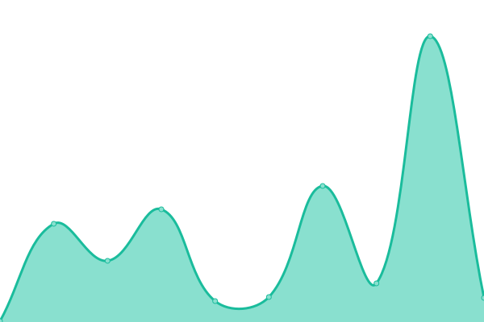

# [📈 Live Status](https://CoopPlayzz.github.io/CoopWebsitesUptime): <!--live status--> **🟩 All systems operational**

This repository contains the open-source uptime monitor and status page for [Coop](coopos.github.io/CoopOS), powered by [Upptime](https://github.com/upptime/upptime).

With [Upptime](https://upptime.js.org), you can get your own unlimited and free uptime monitor and status page, powered entirely by a GitHub repository. We use [Issues](https://github.com/CoopPlayzz/CoopWebsitesUptime/issues) as incident reports, [Actions](https://github.com/CoopPlayzz/CoopWebsitesUptime/actions) as uptime monitors, and [Pages](https://CoopPlayzz.github.io/CoopWebsitesUptime) for the status page.

<!--start: status pages-->
<!-- This summary is generated by Upptime (https://github.com/upptime/upptime) -->
<!-- Do not edit this manually, your changes will be overwritten -->
<!-- prettier-ignore -->
| URL | Status | History | Response Time | Uptime |
| --- | ------ | ------- | ------------- | ------ |
|  [Google](https://www.google.com) | 🟩 Up | [google.yml](https://github.com/coopeeo/CoopWebsitesUptime/commits/HEAD/history/google.yml) | 

 177ms
     
 | 

<a href="https://CoopPlayzz.github.io/CoopWebsitesUptime/history/google">100.00%</a>
    

|  [GitHub](https://github.com/) | 🟩 Up | [git-hub.yml](https://github.com/coopeeo/CoopWebsitesUptime/commits/HEAD/history/git-hub.yml) | 

 101ms
     
 | 

<a href="https://CoopPlayzz.github.io/CoopWebsitesUptime/history/git-hub">100.00%</a>
    

|  [Roblox](https://www.roblox.com/) | 🟩 Up | [roblox.yml](https://github.com/coopeeo/CoopWebsitesUptime/commits/HEAD/history/roblox.yml) | 

 1182ms
     
 | 

<a href="https://CoopPlayzz.github.io/CoopWebsitesUptime/history/roblox">100.00%</a>
    

<!--end: status pages-->

[**Visit our status website →**](https://CoopPlayzz.github.io/CoopWebsitesUptime)

## 📄 License

- Powered by: [Upptime](https://github.com/upptime/upptime)
- Code: [MIT](./LICENSE) © [Coop](coopos.github.io/CoopOS)
- Data in the `./history` directory: [Open Database License](https://opendatacommons.org/licenses/odbl/1-0/)
